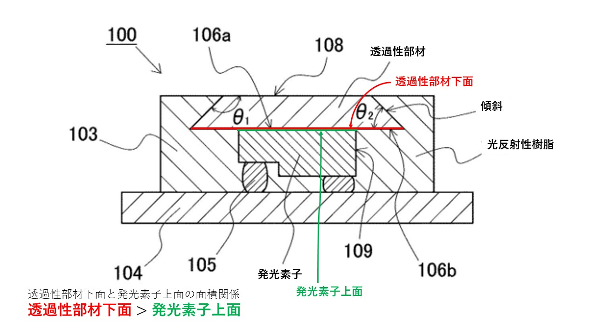

# 要約
## 課題：高輝度な発光を可能とし、優れた信頼性を有する発光装置を提供する。
## [解決手段]
### 最小構成
**発光素子+透光性部材+(透光性部材の外周面の傾斜)+(透光性部材の下面の面積)**
## 用語
**101. 発光素子**  
**102. 透光性部材**  
    - 蛍光体を有することができる
    - 厚みは限定しないが、例として50～300μm程度
**103. 光反射性樹脂**  
**- 発光素子から出射される光を透過して外部に放出する**  
    **1. 傾斜透光性部材の外周面の傾斜**  
  **- 透光性部材の外周側面は、上面から下面に向かって広がる傾斜を持つ。**  
    **2. 透光性部材の下面の面積**  
   **- 発光素子の上面の面積よりも大きく形成されている**  
   **- 透光性部材の下面と発光素子の上面が接合されている**  
   **- 発光素子と結合されていない部分と、傾斜面が光反射性樹脂によって被覆されている。**  
   - 放熱性の良い材料を使う事で熱応力に対して強い発光装置となる。
**107. 傾斜面**  
**- 透光性部材の外周面**  
**- 上面から下面に向かって広がる傾斜**  
- 傾斜面が熱による押し上げを抑える。  
104. 基板
110. 逆傾斜面
    
111. 接合
- 発光素子と透光性部材接合
- 直接の接合に限らず、接着剤などの部材を介しての接合も含む。
- 接着剤に蛍光体が含有される場合もある。
- 発光素子の近傍に配置されることから熱に強い蛍光体を含有することが好ましい。
<!--  -->

# 請求項1
発光装置=発光素子+透光性部材+光反射性部材  
1. 透光性部材
- 上面から下面へ広がる傾斜面を持つ  
- 下面の面積は発光素子の上面の面積よりも大きく形成される
- 下面および発光素子の上面が接合されている
- 光反射性樹脂に被覆される部分
  - 下面の発光素子と接合されていない部分
  - 傾斜面

 
 

# 経過情報

## 拒絶理由通知書
特許法36条第6項第2号を満たしていない。
- 発明の範囲が明確でない。
- 請求項8-21
- （１）
　請求項８の「接合面に対して」は「接合面の面積に対して」と記載されたい。
。
（２）
　請求項１３の「前記傾斜面は、前記透光性部材の外周側面の約５０％以上」は
、傾斜面の何が透光性部材の外周側面の何の約５０％以上であるのかが明確でな
い。　→面積の約50%以上
（３）
　請求項１４－１５の「前記傾斜面」の「前記」は明確でない。
（４）　→傾斜面
　請求項１５の「前記傾斜面が、前記光反射性樹脂により被覆されている」の「
前記傾斜面」が逆傾斜面を含むのかどうか明確でない。
（５）　→並びに傾斜面が、として含むようにしている。
　請求項１７の「前記発光素子の上面の、前記光反射性樹脂から露出している部
分」は意味が明確でない。→該透光性部材の上面

# 先行特許
特開2007-19096号公開
  
## 要約

- 【課題】 コストの低廉化を図ることができるとともに、生産性を高めることができる発光装置及びその製造方法を提供する。
- 背景[0002]
  発光ダイオード（Light Emitting Diode：ＬＥＤ）、レーザーダイオード（Laser Diode：ＬＤ）等の半導体発光素子は、各種の光源として利用されている。特に近年は、蛍光灯に代わる照明用の光源として、より低消費電力で長寿命の次世代照明として注目を集めており、更なる発光出力の向上及び発光効率の改善が求められている。また、車のヘッドライトなどの投光器、投光照明のように、指向性に優れ高輝度な光源も求められている。  
900.   発光装置
902.   蛍光体層

# 独立項
## 請求項1 
【請求項１】
  発光装置=発光素子+透光性部材+光反射性部材  
   
## 請求項14
- 透光性部材の外周側面の形状。
- 中間までが傾斜
- 中間以降が垂直
- 上記の外周側面が被覆されている
- 発光素子と接合されていない部分が被覆されている  

## 請求項15　(add16)
- 透光性部材の外周側面の形状。
- 中間までが傾斜
- 中間以降が逆傾斜
- 上記の外周側面が被覆されている
- 発光素子と接合されていない部分が被覆されている  

## 請求項17 (add18,19,20,21)
透光性部材の下面の面積関係と、被覆関係