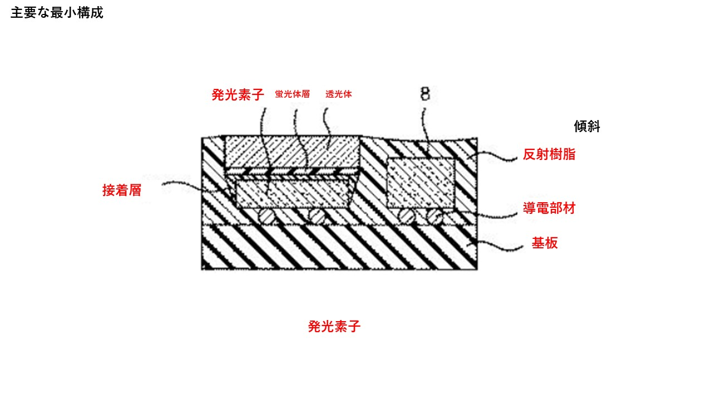

# 要約
## [課題]：蛍光体層の熱伝導性を向上させることの可能な発光装置を提供する。
## [解決手段]
### [最小構成]
**基板+導電部材+発光素子+接着層 +蛍光体層+透光体+反射樹脂**

## 用語
**1. 基板**
- 導電パターンが形成された基板
**2. 発光素子**
- 基板上に導電部材を介して実装された発光素子
**- フリップチップ実装**
**3. 蛍光体層**
**- 発光素子の上面に接着層を介して配置されている**
**- シリコーン樹脂からなるバインダーを含む。**
**4. 透光体**
**- 蛍光体層の上に蛍光体層と一体化して配置されている**
**5. 接着層**
**- 発光素子上面にある**
**- シリコーン樹脂を含む**
**6. 反射樹脂**
- 発光素子、透光体の側面に沿って配置された反射樹脂
**7. 導電部材**
**- 基板上にあり、フリップチップが実装される導電部材**  
## [0006]
蛍光体やバインダーの熱劣化が促進され蛍光強度が低下するという問題がある。
## [0007]
そこで、本発明は、上記の課題を解決し、蛍光体層を薄くして、蛍光体濃度を高くすることが可能な発光装置およびその製造方法を提供することを目的とする。
## [0008]  
透光体の表面に蛍光体層を形成した透光体を用いることにより、上記の課題が解決できることを  見出して本発明を完成させたものである。  
発光装置=基板 + 発光素子 + 蛍光体層 + 透光体 + 反射樹脂  
## [0010]「発明の効果」
 蛍光体濃度を高くしても、蛍光体層を薄くすることが可能な発光装置を提供することが可能となる。
## [0013]
発光装置Ａでは、蛍光体層が透光体と一体として形成されており、透光体４は蛍光体層３の支持体の役割を有している。そのため、透光体４の表面に、蛍光体濃度が高く、厚さがより薄い蛍光体層３を形成することが可能となる。<color style='color: #ff0000;'>これにより、蛍光体濃度を高くしても、蛍光体層３の機械強度が低下することがなく、蛍光体層３の熱伝導性を向上させることが可能となる。</color>また、透光体および蛍光体層の平面積が発光素子の上面の面積と仮に同じ大きさでも構わないが、実際の製造工程における実装精度を考慮すると、透光体および蛍光体層の平面積が発光素子の上面の面積と仮に同じ大きさであれば、発光素子の上面で蛍光体層が配置されない部分が生じる虞がある。そこで、発光素子の上面全体に確実に蛍光体層を配置するため、透光体および蛍光体層の平面積を発光素子の上面の面積よりも大きめにする場合がある。その場合にも、透光体は、蛍光体層の全体を支持する。つまり、透光体の主面全体に配置された蛍光体層のうち、発光素子上面に配置させたとき、発光素子の上面の縁から食み出した蛍光体層の外周部も、その一部が剥離や破損することなく安定に支持することができる。
## [0017]
  蛍光体層は、透光体の表面に印刷などにより形成される。ここで、本形態における蛍光体層には、蛍光体層が透光体の表面に直接接しているだけでなく、接着剤等の他
の部材を介して接合する場合も含まれる。例えば、圧着、融着、焼結、有機系接着剤による接着、低融点ガラス等の無機系接着剤による接着を挙げることができる。蛍光体層の形成方法には、印刷法、圧縮成形法、蛍光体電着法、蛍光体シート法等を用いることができる。印刷法は、蛍光体、バインダーおよび溶剤を含むペーストを調製し、そのペーストを透光体の表面に塗布し、乾燥することにより蛍光体層を形成する。バインダーには、エポキシ樹脂、シリコーン樹脂、フェノール樹脂、およびポリイミド樹脂等の有機樹脂バインダーやガラス等の無機バインダーを用いることができる。圧縮成形法は、透光体の表面に、バインダーに蛍光体を含有させた蛍光体層の材料を金型で成形する方法である。蛍光体電着法は、透光体の表面に、透光性にすることが可能な導電性の薄膜を形成させておき、電気泳動を利用して、帯電した蛍光体を、薄膜上に堆積させる方法である。<color style='color: #ff0000;'>蛍光体シート法は、シリコーン樹脂に蛍光体を混練し、シート状に加工した蛍光体シートを用いるもので、蛍光体からの放熱性を向上させる点から、蛍光体シートの厚さは、薄ければいくらでもよいが１００μｍ以下程度の蛍光体シートを透光体に圧着して一体化する方法である。</color>
## [0025](接着層)
- 接着層を構成する接着剤は、発光素子からの出射光を蛍光体層へと有効に導光でき、発光素子と蛍光体層を光学的に連結できる材料が好ましい。
- 具体例としてはエポキシ樹脂、シリコーン樹脂、フェノール樹脂、およびポリイミド樹脂等の有機樹脂を挙げることができるが、シリコーン樹脂が好ましい。
- 接着層の厚さは、薄ければ薄いほど好ましい。
- 放熱性が向上する点と、接着層を透過する光の損失が少なくなることで、発光装置からの光出力が向上する点からである。
## [0026]
接着層は、発光素子と蛍光体層の間のみならず、発光素子の側面にも存在することが好ましい。側面の接着層は、発光素子の側面からの出射光を反射して、蛍光体層内に入射させて、蛍光体の光変換効率を向上させることができるからである。
特に、図１（ｃ）に示すように、発光素子の側面においては、鉛直方向の断面視で、発光素子の側面と蛍光体層３、発光素子側の面から形成される隅部に接着剤が延在し、その延在した接着層の厚さが発光素子の下部方向に向かって小さくなる断面三角形状であることが好ましい。さらに、その断面三角形状の接着層に接するように反射樹脂の一部が配置されていることが好ましい。
これにより、発光素子の側面からの出射光が、その断面三角形状の接着層と反射樹脂との界面にて反射され、発光素子の上面よりも蛍光体層の面積が大きく、発光素子の上面から外へ食み出した蛍光体層の外周部にも入射し易くなり、発光装置の発光輝度をさらに向上させることができる。このような接着層の食み出しは、主面に蛍光体層を配置した透光体を、発光素子の上面に接着する接着剤の量を調整することによって、発光素子の上面との接着に必要な接着剤量以外の余剰分を発光素子側面に食み出させることによって形成することもできる。また、透光体に配置する蛍光体層のバインダーの量を調整して、そのバインダーが半硬化の状態で、蛍光体層を発光素子の上面に押圧して、バインダーの一部を発光素子の側面に延在させることによっても形成することができる。接着層の食み出しの断面三角形状は、シリコーン樹脂などと発光素子側面や蛍光体層の表面との濡れ性や粘度を適正化することによって形成することができる。

# 独立請求項
## 請求項1
 発光装置= 基板+発光素子+蛍光体層+透光体 + 反射樹脂 + 接着層 
 蛍光体層はシリコーン樹脂からなるバインダーを含む
 接着層はシリコーン樹脂を含む
## 請求項7 
発光装置の製造方法
基板の上に発光素子を配置する工程
予め蛍光体層を表面に形成させておいた透光体を、該蛍光体層を該発光素子の上面に向けて、該透光体を該発光素子の上に接着層を介して配置する工程
該発光素子の側面および該蛍光体層の側面および該透光体の側面に沿って反射樹脂を配置する工程

##意見書
<blockquote>
しかしながら、補正後の請求項１は、発光素子と蛍光体層との間に接着層を有しており
、かつ蛍光体層はシリコーン樹脂からなるバインダーを含み接着層はシリコーン樹脂を含
むものです。
　これに対して、引用文献２及び引用文献３に記載された発明は、いずれも蛍光体を分散
させた未硬化の樹脂を発光素子の上に塗布することにより蛍光体含有樹脂層を形成してお
り（例えば、引用文献２については段落００４４、引用文献３については段落００３６参
照）、<color style='color: #ff0000;'>発光素子と蛍光体層との間に接着層を含むことは開示も示唆もしておりません。</color>
　したがって、本願請求項１記載の発明は、引用文献２及び引用文献３には開示も示唆も
されていない構成を含んでおり、引用文献２に記載された発明ではなく、また、引用文献
３に記載された発明ではありません。
</blockquote>
//蛍光体層を薄くした事で熱伝導性を上げた。薄くすることで輝度は下がるはずだが、接着層を活用する事で輝度を維持した構造となっている